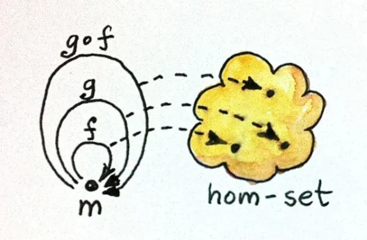

# 크고 작은 범주

> 프로그래머를 위한 범주론의 이전 글에서는 [타입과 함수](https://github.com/alstn2468/category-theory-for-programmers/blob/main/part-1/02-types-and-functions.md)에 관해 이야기했습니다. 시리즈를 처음 접한다면 [목차](https://github.com/alstn2468/category-theory-for-programmers#part-1)를 확인하세요.

다양한 예시를 통해 범주에 대한 진정한 감상을 얻을 수 있습니다. 범주는 모든 모양과 크기로 제공되며 종종 예상하지 않은 위치에 나타납니다. 아주 간단한 것부터 시작해보겠습니다.


## 객체가 없는 범주

가장 사소한 범주는 객체가 없고 결과적으로 사상이 없는 범주입니다. 그 자체로 매우 슬픈 범주이지만 모든 범주의 범주(하나가 있습니다)와 같이 다른 범주의 맥락에서 중요할 수 있습니다. 비어있는 집합이 의미가 있다고 생각한다면 빈 범주는 의미가 없다고 생각한 이유가 무엇인가요?

## 단순 그래프

화살표로 객체를 연결하는 것만으로 범주를 만들 수 있습니다. 방향 그래프로 시작하여 단순히 더 많은 화살표를 추가해 범주로 만드는 것을 상상할 수 있습니다. 먼저 각 노드에 항등(identity) 화살표를 추가합니다. 그런 다음 하나의 끝이 다른 화살표의 시작과 일치하는 두 개의 화살표(즉, 두 개의 합성 가능한 화살표)에 대해 새 화살표를 추가하여 합성으로 사용할 수 있습니다. 새 화살표를 추가할 때마다 다른 화살표(항등 화살표 제외) 및 자기 자신과의 합성도 고려해야 합니다. 일반적으로 무한히 많은 화살표가 생성되지만 괜찮습니다.

이 과정을 보는 다른 방법은 그래프의 모든 노드에 대한 객체와 합성할 수 있는 그래프의 간선의 모든 연결을 사상으로 갖는 범주로 만드는 것입니다. (항등 사상을 길이가 0인 연결의 특별한 경우로 고려할 수 있습니다)

이런 범주를 주어진 그래프에 의해 생성된 자유 범주라고 합니다. 주어진 구조를 최소한의 항목으로 확장해 그 법칙(여기서는 범주의 법칙)을 만족시키는 과정으로, 자유 구성의 한 예시입니다. 앞으로 더 많은 예시를 보게 될 것입니다.

## 순서

그리고 이제 완전 다른 것을 위해 사상이 객체 간의 관계(작거나 같음의 관계)인 범주가 정말 범주인지 확인해 보겠습니다. 모든 객체는 항등 사상을 가지고 있는 것을 확인할 수 있나요? 모든 객체는 자기 자신보다 작거나 같음을 확인할 수 있습니다. 합성 또한 확인할 수 있나요? a <= b이고 b <= c이면 a <= c를 만족하는 것을 확인할 수 있습니다. 합성이 결합법칙을 만족하는 것도 확인할 수 있나요? 확인할 수 있습니다. 이와 같은 관계가 있는 집합을 원순서 집합(preorder set)이라고 하므로 원순서 집합은 실제로 범주입니다.

또한 a <= b 및 b <= a이면 a가 b와 같아야 한다는 추가 조건을 충족하는 더 강력한 관계를 가질 수도 있습니다. 이것을 부분 순서(partial order)라고 합니다

마지막으로, 두 객체가 어떤 방식으로든 서로 연관되어 있다는 조건을 부과할 수 있습니다. 여기에 선형 순서(linear order)나 전 순서(total order)를 부여할 수 있습니다.

이런 순서가 있는 집합을 범주로 특성화해 보겠습니다. 원순서 집합은 어떤 객체 a에서 객체 b로 이동하는 최대 하나의 사상이 있는 범주입니다. 이 범주의 또 다른 이름은 "thin"입니다. 원순서 집합은 얇은 범주입니다.

범주 C에서 객체 a에서 객체 b로의 사상 집합을 hom-set이라고 하며 C(a, b) 또는 HomC(a,b)로 작성합니다. 따라서 모든 원순서의 hom-set은 비어 있거나 하나만 존재합니다. 여기에는 home-set C(a, a)가 포함됩니다. a에서 a까지의 사상 집합은 모든 원순서 집합에서 항등 사상 하나만 포함해야 합니다. 그러나 원순서 집합에 순환이 있을 수 있습니다. 순환은 부분 순서 집합에서 금지됩니다.

정렬로 인해 원순서 집합, 부분 순서 집합, 전 순서 집합을 인지할 수 있는 것은 매우 중요합니다. 퀵 정렬, 버블 정렬, 병합 정렬과 같은 정렬 알고리즘은 전 순서 집합에서만 올바르게 동작합니다. 부분 순서 집합은 토폴로지 정렬(topological sort)을 사용해 정렬할 수 있습니다.

## 집합으로서의 Monoid

Monoid는 창피할 정도로 단순하지만 놀랍도록 강력한 개념입니다. 이것은 기본 산술 뒤에 있는 개념입니다. 덧셈과 곱셈은 모두 Monoid를 구성합니다. Monoid는 프로그래밍에서 어디에나 있습니다. 그것들은 문자열, 리스트, 접을 수 있는 데이터 구조, 동시성 프로그래밍의 미래, 함수형 반응형 프로그래밍의 이벤트 등으로 나타납니다.

전통적으로 Monoid는 이진 연산이 있는 집합으로 정의됩니다. 이 작업에서 요구되는 모든 것은 결합성이 있고 이 작업에 대해 unit처럼 작동하는 하나의 특별한 요소가 있다는 것입니다.

예를 들어, 0인 자연수는 덧셈에서 Monoid를 구성합니다. 결합성은 아래 내용을 의미합니다.

```
(a + b) + c = a + (b + c)
```

즉, 숫자를 추가할 때 괄호를 생략할 수 있습니다.

다음과 같은 이유로 중립 요소는 0입니다.

```
0 + a = a
a + 0 = a
```

두 번째 방정식은 덧셈이 교환법칙을 성립하기 때문에 (a + b = b + a) 중복되지만, 교환법칙은 Monoid의 정의의 일부가 아닙니다. 예를 들어, 문자열 연결은 교환 법칙을 성립하지 않지만, Monoid를 구성합니다. 그런데 문자열 연결을 위한 중립 요소는 빈 문자열로, 문자열을 변경하지 않고 양쪽에 붙일 수 있습니다.

Haskell에서는 `mempty`라는 중립 요소와 `mappend`라는 이진 연산이 있는 Monoid에 대한 타입 클래스를 정의할 수 있습니다.

```haskell
class Monoid m where
    mempty  :: m
    mappend :: m -> m -> m
```

인자가 두 개인 함수 `m->m->m`의 타입 시그니처는 이상하게 보일 수 있지만 커링에 대한 이야기를 한 후에는 완벽하게 이해가 될 것입니다. 여러 개의 화살표가 있는 시그니처를 두 가지 기본 방식으로 해석할 수 있습니다. 여러 개의 인자의 함수로 가장 오른쪽 타입이 반환 타입인 경우와 하나의 인자(가장 왼쪽에 있는 인자)의 함수로 함수를 반환하는 경우입니다. 후자의 해석은 `m->(m->m)`과 같이 괄호(화살표가 오른쪽 결합이므로 중복)를 추가하여 강조할 수 있습니다. 잠시 후 이 해석으로 돌아오겠습니다.

Haskell에서는 `mempty`와 `mappend`의 Monoid 속성(`mempty`는 중립이고 `mappend`는 결합성이 있다는 사실)을 표현할 방법이 없습니다. 그것을 만족하는지 확인하는 것은 프로그래머의 책임입니다.

Haskell 클래스는 C++ 클래스만큼 방해가 되지는 않습니다. 새 타입을 정의할 때 클래스를 미리 지정할 필요가 없습니다. 주어진 타입을 훨씬 나중에 어떤 클래스의 인스턴스로 미루고 선언할 수 있습니다. 예를 들어, `mempty` 및 `mappend`의 구현을 제공해 `String`을 Monoid로 선언합니다. (이것은 실제로 표준 Prelude에서 사용됩니다)

```haskell
instance Monoid String where
    mempty = ""
    mappend = (++)
```

여기서 우리는 리스트 연결 연산자`(++)`를 재사용했습니다. `String`은 문자 목록일 뿐입니다.

Haskell 구문에 대한 한마디: 모든 중위 연산자는 괄호로 둘러싸 두 인자의 함수로 변환할 수 있습니다.

```haskell
"Hello " ++ "world!"
```

두 개의 문자열이 주어지면 그사이에 `++`을 삽입하여 연결할 수 있으며 또는 괄호로 묶은 `(++)`에 두 개의 인수로 전달합니다.

```haskell
(++) "Hello " "world!"
```

함수에 대한 인자는 쉼표로 구분되거나 괄호로 묶이지 않습니다. (이것이 Haskell을 배울 때 가장 익숙해지기 힘든 부분일 것입니다)

Haskell을 사용하면 아래와 같이 함수의 등식을 표현할 수 있다는 점을 강조할 가치가 있습니다.

```haskell
mappend = (++)
```

개념적으로 이것은 아래와 같이 함수에 의해 생성된 값의 등식을 표현하는 것과 다릅니다.

```haskell
mappend s1 s2 = (++) s1 s2
```

전자는 범주 **Hask**(또는 **Set**, bottom을 무시하는 경우)에서 사상의 등식으로 해석됩니다. 이런 방정식은 더 간결할 뿐 아니라 종종 다른 범주로 일반화될 수 있습니다. 후자는 확장적 등식이라고 하며 두 입력 문자열에 대해 `mappend`와 `(++)`의 출력이 동일하다는 사실을 나타냅니다. 인자의 값을 point라고 하는 경우가 있으므로(예: point x에서 f의 값) 이를 점별(point-wise) 등식이라고 합니다. 인자를 지정하지 않은 함수는 포인트 프리(point-free)로 설명됩니다. 덧붙여, 포인트 프리 방정식은 종종 점으로 상징되는 함수의 합성을 표현하므로 초보자에게는 약간 혼란스러울 수 있습니다.

C++에서 Monoid를 선언하는데 가장 가까운 것은 개념에 대해 (제안된, proposed) 문법을 사용하는 것입니다.

```cpp
template<class T>
  T mempty = delete;

template<class T>
  T mappend(T, T) = delete;

template<class M>
  concept bool Monoid = requires (M m) {
    { mempty<M> } -> M;
    { mappend(m, m); } -> M;
  };
```

첫 번째 정의는 값 템플릿(제안된, proposed)을 사용합니다. 다형성 값은 모든 타입에 대해 다른 값인 값의 집합입니다.

키워드 `delete`는 정의된 기본값이 없음을 의미합니다. 이는 사용할 때 각각 지정해야 합니다. 마찬가지로 `mappend`에 대한 기본값은 없습니다.

`Monoid`라는 개념은 주어진 `M`에 대해 `mempty`와 `mappend`에 대한 적절한 정의가 있는지를 테스트하는 술어(predicate, 따라서 `bool` 타입입니다)입니다.

Monoid 개념의 인스턴스화는 적절한 특수화와 오버로드를 사용해 수행할 수 있습니다.

```cpp
template<>
std::string mempty<std::string> = {""};

std::string mappend(std::string s1, std::string s2) {
    return s1 + s2;
}
```

## 범주로서의 Monoid

지금까지 설명한 것들이 집합의 요소에 관한 Monoid의 "익숙한" 정의였습니다. 하지만 아시다시피, 범주론에서 우리는 집합과 그 요소에서 벗어나 객체와 사상에 관해 이야기하려고 합니다. 따라서 관점을 조금 바꿔서 이항 연산자의 적용을 집합 주변에서 이동("moving" 또는 "shifting")하는 것으로 생각해봅시다.

예를 들어 모든 자연수에 5를 더하는 연산이 있습니다. 0에서 5, 1에서 6, 2에서 7등으로 매핑됩니다. 그것은 자연수 집합에 대해 정의된 함수입니다. 좋습니다. 함수와 집합이 있습니다. 일반적으로 임의의 수 n에 대해 n을 더하는 함수가 있습니다. 즉, n의 "가산기(adder)"입니다.

가산기는 어떻게 합성할 수 있을까요? 5를 더하는 함수와 7을 더하는 함수의 합성은 12를 더하는 함수입니다. 따라서 가산기의 합성은 덧셈 규칙과 동일하게 만들 수 있습니다. 좋습니다. 덧셈을 함수 합성으로 대체할 수 있습니다.

하지만, 더 많은 것이 있습니다. 중립 요소인 0에 대한 가산기도 있습니다. 0을 더하면 값이 변하지 않으므로 자연수 집합의 항등함수입니다.

기존의 덧셈 규칙 대신 정보 손실 없이 가산기 합성 규칙을 알려드릴 수 있습니다. 함수의 합성이 결합성이 있는 것을 주목해야 합니다. 그리고 항등함수에 해당하는 0 가산기가 있습니다.

예리한 독자는 정수에서 가산기로의 대응이 `mappend`의 타입 시그니처를 `m->(m->m)`로 두 번째 해석에 해당한다는 것을 알아차렸을 것입니다. `mappend`는 Monoid 집합의 요소를 해당 집합에 작용하는 함수에 대응된다고 알려줍니다.

이제부터는 일련의 자연수를 다루고 있다는 사실을 잊어버리고 그것을 하나의 객체로 생각하기를 바랍니다. 덧셈이라는 많은 사상이 있는 덩어리를 의미합니다. Monoid는 단일 객체 범주입니다. 실제로 Monoid라는 이름은 단일을 의미하는 그리스어 mono에서 유래되었습니다. 모든 Monoid는 적절한 합성 규칙을 따르는 일련의 사상이 있는 단일 객체 범주로 설명할 수 있습니다.

<div align='center'>
  
</div>

문자열 연결은 왼쪽 가산, 오른쪽 가산(원하는 경우 prepender)을 정의할 수 있기 때문에 흥미로운 경우입니다. 두 모델의 합성표는 서로 반대입니다. "foo" 다음에 "bar"를 추가하는 것은 "bar"를 앞에 붙이고 "foo"를 추가하는 것과 일치한다는 것을 쉽게 확신할 수 있습니다.

모든 범주형 Monoid(하나의 객체 범주)가 이진 연산자로 고유한 집합 Monoid를 정의하는지 여부에 대해 질문할 수 있습니다. 항상 단일 객체 범주에서 집합을 추출할 수 있습니다. 이 집합은 사상 집합이며, 예시의 가산기입니다. 다시 말해, 범주 M에 있는 단일 객체 m은 home-set M(m, m)을 가지고 있습니다. 이 집합에서 이진 연산자를 쉽게 정의할 수 있습니다. 두 집합 원소의 Monoid 곱은 해당 사상의 합성에 해당하는 요소입니다. f와 g에 해당하는 M(m, m)의 두 요소를 제공하면 그 곱은 `g∘f` 합성에 해당할 것입니다. 이런 사상의 출처와 대상이 동일한 객체이기 때문에 합성은 항상 존재합니다. 그리고 범주 규칙과 연관성이 있습니다. 항등 사상은 이 곱의 중립적인 요소입니다. 따라서 우리는 항상 범주 Monoid에서 집합 Monoid를 복구할 수 있습니다. 모든 의도와 목적에서 그것들은 하나이고 같습니다.

<div align='center'>
  <figure>
    <div>
      
    </div>
    <figcaption>
      사상과 점 집합으로 보이는 Monoid home-set
    </figcaption>
  </figure>
</div>

수학자들이 선택해야 할 단 하나의 작은 핵심이 있습니다. 사상은 집합을 형성할 필요가 없습니다. 범주의 세계에는 집합보다 더 큰 것이 있습니다. 임의의 두 객체 사이의 사상이 집합을 이루는 범주를 작은 범주라고 합니다. 약속한 대로 그런 미묘한 부분은 대부분 무시하겠지만, 기록을 위해 언급해야겠다고 생각했습니다.

범주론의 많은 흥미로운 현상은 hom-set의 요소가 합성 규칙을 따르는 형태와 점 집합으로 모두 볼 수 있다는 사실에 뿌리를 두고 있습니다. 여기에서 M의 사상의 합성은 집합 M(m, m)의 Monoid 곱으로 변환됩니다.

## 감사의 말

Andrew Sutton과 Bjarne Stroustrup의 최신 제안에 따라 C++ 모노이드 개념 코드를 다시 작성해 준 Andrew Sutton에게 감사드립니다.

## 도전

1. 아래 내용에서 자유 범주를 생성해보세요.
    1. 노드가 하나이고 간선이 없는 그래프
    2. 하나의 노드와 하나의 간선이 있는 방향 그래프 (힌트: 이 간선은 자체적으로 합성될 수 있습니다)
    3. 두 개의 노드와 그 사이에 단일 화살표가 있는 그래프
    4. 단일 노드와 알파벳 문자로 표시된 26개의 화살표가 있는 그래프: a, b, c ... z.
2. 이것들은 어떤 종류의 순서인가요?
    1. 포함 관계가 있는 집합들의 집합: A의 모든 요소가 B의 요소이기도 하면 A가 B에 포함됩니다.
    2. 아래 하위 타입 지정 관계가 있는 C++ 타입: T1에 대한 포인터가 컴파일 오류를 발생시키지 않고 T2에 대한 포인터를 예상하는 함수에 전달할 수 있는 경우 T1은 T2의 하위 타입입니다.
3. Bool이 True와 False의 두 값의 집합이라는 것을 고려하면, 연산자 `&&` 와 `||`에 대해 각각 두 개의 (집합 이론적인) Monoid를 형성함을 확인해보세요.
4. AND 연산자를 범주로써 Bool Monoid를 사상과 합성 규칙으로 표현해 보세요.
5. 3을 더하는 모듈을 범주 Monoid로 표현해 보세요.

[⬅ 뒤로가기](https://github.com/alstn2468/category-theory-for-programmers/blob/main/part-1/02-types-and-functions.md) / [다음으로 ➡](https://github.com/alstn2468/category-theory-for-programmers/blob/main/part-1/04-kleisli-categories.md)

<div align="center">

<sub><sup>Translated by <a href="https://github.com/alstn2468">@Minsu Kim</a></sup></sub><small>✌</small>

</div>