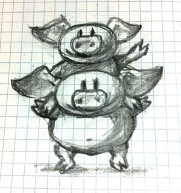

# Kleisli 범주

> 프로그래머를 위한 범주론의 이전 몇 개의 글에서 [크고 작은 범주](https://github.com/alstn2468/category-theory-for-programmers/blob/main/part-1/03-categories-great-and-small)의 몇 가지 예시를 제시했습니다. 이 글에서는 더 고급 예시를 통해 설명을 진행할 것입니다. 이 시리즈를 처음 접하는 경우 [목차](https://github.com/alstn2468/category-theory-for-programmers#part-1)를 확인하세요.

## 로그 합성

타입과 순수 함수를 범주로 모델링 하는 방법을 살펴보았습니다. 또한 범주론에서 부작용, 즉 순수하지 않은 함수를 모델링하는 방법이 있다고 언급했습니다. 실행을 기록하거나 추적하는 함수라는 예시를 살펴보겠습니다. 명령형 언어에서는 아래와 같이 전역 상태를 변경하여 구현될 가능성이 있습니다.

```cpp
string logger;

bool negate(bool b) {
     logger += "Not so! ";
     return !b;
}
```

이 기억된 버전의 함수는 로그를 생성하지 못하기 때문에 순수 함수가 아니라는 것을 알고 있습니다. 이 함수에는 부작용가 있습니다.

현대 프로그래밍에서 우리는 가능한 한 변경 가능한 전역 상태를 피하려고 노력합니다. 동시성의 복잡성 때문입니다. 그리고 라이브러리에 이런 코드를 넣지 않을 것입니다.

다행히도 이 함수를 순수하게 만드는 것이 가능합니다. 로그를 명시적으로 안팎으로 전달하기만 하면 됩니다. 문자열 인자를 추가하고 업데이트된 로그가 포함된 문자열과 일반 출력을 쌍으로 만들어 보겠습니다.

```cpp
pair<bool, string> negate(bool b, string logger) {
     return make_pair(!b, logger + "Not so! ");
}
```

이 함수는 순수하고 부작용이 없으며 동일한 인자로 호출될 때마다 동일한 쌍을 반환하며 필요한 경우 기억할 수 있습니다. 그러나 로그의 누적되는 특성을 고려할 때 주어진 호출로 이어질 수 있는 모든 가능한 로그들을 기억해야 합니다. 아래에 각각 기억되는 항목이 있습니다.

```cpp
negate(true, "It was the best of times. ");
// 또는
negate(true, "It was the worst of times. ");
// 등등
```

또한 라이브러리 기능을 위한 아주 좋은 인터페이스도 아닙니다. 호출자는 반환 타입의 문자열을 자유롭게 무시할 수 있으므로 큰 부담은 아닙니다. 그러나 입력으로 문자열을 전달해야 하므로 불편할 수 있습니다.

같은 일을 덜 방해가 되는 방법으로 관심사를 분리하는 방법이 있을까요? 이 간단한 예시에서 negate 함수의 목적은 하나의 Boolena을 다른 것으로 바꾸는 것입니다. 로그를 남기는 것은 2차적입니다. 물론 기록되는 메시지는 함수에 따라 다르지만 메시지를 하나의 연속 로그로 집계하는 작업은 별개의 문제입니다. 우리는 여전히 함수가 문자열을 생성하기를 원하지만, 로그 생성에서 부담을 덜어주고 싶습니다. 타협할 수 있는 해결책은 아래와 같습니다.

```cpp
pair<bool, string> negate(bool b) {
     return make_pair(!b, "Not so! ");
}
```

이 아이디어는 로그가 함수 호출 간에 수집된다는 것입니다.

이것이 어떻게 가능한지 보기 위해 조금 더 현실적인 예시로 바꾸어 보겠습니다. 문자열에서 소문자를 대문자로 바꾸는 하나의 함수가 있습니다.

```cpp
string toUpper(string s) {
    string result;
    int (*toupperp)(int) = &toupper; // toupper는 overload 되었습니다.
    transform(begin(s), end(s), back_inserter(result), toupperp);
    return result;
}
```

다른 하나는 문자열을 공백 경계로 문자열 벡터로 나눕니다.

```cpp
vector<string> toWords(string s) {
    return words(s);
}
```

실제 작업은 보조 함수 words에서 수행됩니다.

```cpp
vector<string> words(string s) {
    vector<string> result{""};
    for (auto i = begin(s); i != end(s); ++i)
    {
        if (isspace(*i))
            result.push_back("");
        else
            result.back() += *i;
    }
    return result;
}
```



`toUpper` 및 `toWords` 함수를 수정해 일반 반환 값 위에 메시지 문자열을 피기백(piggyback) 하도록 합니다.

우리는 이런 함수의 반환 값을 "장식"(embellish)할 것입니다. 첫 번째 컴포넌트가 임의 타입 A의 값이고 두 번째 구성 요소가 문자열인 쌍을 캡슐화하는 템플릿 `Writer`를 정의해 일반적인 방식으로 처리해 보겠습니다.


```cpp
template<class A>
using Writer = pair<A, string>;
```

아래는 장식된 함수입니다.

```cpp
Writer<string> toUpper(string s) {
    string result;
    int (*toupperp)(int) = &toupper;
    transform(begin(s), end(s), back_inserter(result), toupperp);
    return make_pair(result, "toUpper ");
}

Writer<vector<string>> toWords(string s) {
    return make_pair(words(s), "toWords ");
}
```

이 두 함수를 문자열을 대문자로 바꾸고 이를 단어로 나누는 또 다른 장식된 함수로 합성하고 그 작업의 로그를 생성하기를 원합니다. 방법은 아래와 같습니다.

```cpp
Writer<vector<string>> process(string s) {
    auto p1 = toUpper(s);
    auto p2 = toWords(p1.first);
    return make_pair(p2.first, p1.second + p2.second);
}
```

우리는 목표를 달성했습니다. 로그 수집은 더 이상 개별 함수의 문제가 아닙니다. 이것들은 자체적인 메시지를 생성한 다음 외부에서 더 큰 로그로 연결합니다.

이제 이 스타일로 작성된 전체 프로그램을 상상해 보세요. 반복적이고 오류가 발생하기 쉬운 코드의 악몽입니다. 하지만 우리는 프로그래머입니다. 우리는 반복적인 코드를 처리하는 방법을 알고 있습니다. 우리는 이것들의 함수 합성 자체를 추상화해야 합니다. 그러나 합성은 범주론의 본질이므로 더 많은 코드를 작성하기 전에 범주 관점에서 문제를 분석해 보겠습니다.

## Writer 범주

The idea of embellishing the return types of a bunch of functions in order to piggyback some additional functionality turns out to be very fruitful. We’ll see many more examples of it. The starting point is our regular category of types and functions. We’ll leave the types as objects, but redefine our morphisms to be the embellished functions.

For instance, suppose that we want to embellish the function `isEven` that goes from `int` to `bool`. We turn it into a morphism that is represented by an embellished function. The important point is that this morphism is still considered an arrow between the objects int and bool, even though the embellished function returns a pair:

```cpp
pair<bool, string> isEven(int n) {
     return make_pair(n % 2 == 0, "isEven ");
}
```

By the laws of a category, we should be able to compose this morphism with another morphism that goes from the object bool to whatever. In particular, we should be able to compose it with our earlier negate:

```cpp
pair<bool, string> negate(bool b) {
     return make_pair(!b, "Not so! ");
}
```

Obviously, we cannot compose these two morphisms the same way we compose regular functions, because of the input/output mismatch. Their composition should look more like this:

```cpp
pair<bool, string> isOdd(int n) {
    pair<bool, string> p1 = isEven(n);
    pair<bool, string> p2 = negate(p1.first);
    return make_pair(p2.first, p1.second + p2.second);
}
```

So here’s the recipe for the composition of two morphisms in this new category we are constructing:

1. Execute the embellished function corresponding to the first morphism
2. Extract the first component of the result pair and pass it to the embellished function corresponding to the second morphism
3. Concatenate the second component (the string) of of the first result and the second component (the string) of the second result
4. Return a new pair combining the first component of the final result with the concatenated string.

If we want to abstract this composition as a higher order function in C++, we have to use a template parameterized by three types corresponding to three objects in our category. It should take two embellished functions that are composable according to our rules, and return a third embellished function:

```cpp
template<class A, class B, class C>
function<Writer<C>(A)> compose(function<Writer<B>(A)> m1, 
                               function<Writer<C>(B)> m2)
{
    return [m1, m2](A x) {
        auto p1 = m1(x);
        auto p2 = m2(p1.first);
        return make_pair(p2.first, p1.second + p2.second);
    };
}
```

Now we can go back to our earlier example and implement the composition of `toUpper` and `toWords` using this new template:

```cpp
Writer<vector<string>> process(string s) {
   return compose<string, string, vector<string>>(toUpper, toWords)(s);
}
```

There is still a lot of noise with the passing of types to the `compose` template. This can be avoided as long as you have a C++14-compliant compiler that supports generalized lambda functions with return type deduction (credit for this code goes to Eric Niebler):

```cpp
auto const compose = [](auto m1, auto m2) {
    return [m1, m2](auto x) {
        auto p1 = m1(x);
        auto p2 = m2(p1.first);
        return make_pair(p2.first, p1.second + p2.second);
    };
};
```

In this new definition, the implementation of `process` simplifies to:

```cpp
Writer<vector<string>> process(string s){
   return compose(toUpper, toWords)(s);
}
```

But we are not finished yet. We have defined composition in our new category, but what are the identity morphisms? These are not our regular identity functions! They have to be morphisms from type A back to type A, which means they are embellished functions of the form:

```cpp
Writer<A> identity(A);
```

They have to behave like units with respect to composition. If you look at our definition of composition, you’ll see that an identity morphism should pass its argument without change, and only contribute an empty string to the log:

```cpp
template<class A>
Writer<A> identity(A x) {
    return make_pair(x, "");
}
```

You can easily convince yourself that the category we have just defined is indeed a legitimate category. In particular, our composition is trivially associative. If you follow what’s happening with the first component of each pair, it’s just a regular function composition, which is associative. The second components are being concatenated, and concatenation is also associative.

An astute reader may notice that it would be easy to generalize this construction to any monoid, not just the string monoid. We would use mappend inside `compose` and `mempty` inside `identity` (in place of `+` and `""`). There really is no reason to limit ourselves to logging just strings. A good library writer should be able to identify the bare minimum of constraints that make the library work — here the logging library’s only requirement is that the log have monoidal properties.

## Writer in Haskell

The same thing in Haskell is a little more terse, and we also get a lot more help from the compiler. Let’s start by defining the `Writer` type:

```haskell
type Writer a = (a, String)
```

Here I’m just defining a type alias, an equivalent of a `typedef` (or `using`) in C++. The type `Writer` is parameterized by a type variable `a` and is equivalent to a pair of `a` and `String`. The syntax for pairs is minimal: just two items in parentheses, separated by a comma.

Our morphisms are functions from an arbitrary type to some `Writer` type:

```haskell
a -> Writer b
```

We’ll declare the composition as a funny infix operator, sometimes called the “fish”:

```haskell
(>=>) :: (a -> Writer b) -> (b -> Writer c) -> (a -> Writer c)
```

It’s a function of two arguments, each being a function on its own, and returning a function. The first argument is of the type `(a->Writer b)`, the second is `(b->Writer c)`, and the result is `(a->Writer c)`.

Here’s the definition of this infix operator — the two arguments `m1` and `m2` appearing on either side of the fishy symbol:

```haskell
m1 >=> m2 = \x ->
    let (y, s1) = m1 x
        (z, s2) = m2 y
    in (z, s1 ++ s2)
```

The result is a lambda function of one argument `x`. The lambda is written as a backslash — think of it as the Greek letter λ with an amputated leg.

The `let` expression lets you declare auxiliary variables. Here the result of the call to `m1` is pattern matched to a pair of variables `(y, s1)`; and the result of the call to `m2`, with the argument `y` from the first pattern, is matched to `(z, s2)`.

It is common in Haskell to pattern match pairs, rather than use accessors, as we did in C++. Other than that there is a pretty straightforward correspondence between the two implementations.

The overall value of the `let` expression is specified in its in clause: here it’s a pair whose first component is `z` and the second component is the concatenation of two strings, `s1++s2`.

I will also define the identity morphism for our category, but for reasons that will become clear much later, I will call it `return`.

```haskell
return :: a -> Writer a
return x = (x, "")
```

For completeness, let’s have the Haskell versions of the embellished functions `upCase` and `toWords`:

```haskell
upCase :: String -> Writer String
upCase s = (map toUpper s, "upCase ")
```

```haskell
toWords :: String -> Writer [String]
toWords s = (words s, "toWords ")
```
The function `map` corresponds to the C++ `transform`. It applies the character function `toUpper` to the string `s`. The auxiliary function `words` is defined in the standard Prelude library.

Finally, the composition of the two functions is accomplished with the help of the fish operator:

```haskell
process :: String -> Writer [String]
process = upCase >=> toWords
```

## Kleisli Categories

You might have guessed that I haven’t invented this category on the spot. It’s an example of the so called Kleisli category — a category based on a monad. We are not ready to discuss monads yet, but I wanted to give you a taste of what they can do. For our limited purposes, a Kleisli category has, as objects, the types of the underlying programming language. Morphisms from type A to type B are functions that go from A to a type derived from B using the particular embellishment. Each Kleisli category defines its own way of composing such morphisms, as well as the identity morphisms with respect to that composition. (Later we’ll see that the imprecise term “embellishment” corresponds to the notion of an endofunctor in a category.)

The particular monad that I used as the basis of the category in this post is called the writer monad and it’s used for logging or tracing the execution of functions. It’s also an example of a more general mechanism for embedding effects in pure computations. You’ve seen previously that we could model programming-language types and functions in the category of sets (disregarding bottoms, as usual). Here we have extended this model to a slightly different category, a category where morphisms are represented by embellished functions, and their composition does more than just pass the output of one function to the input of another. We have one more degree of freedom to play with: the composition itself. It turns out that this is exactly the degree of freedom which makes it possible to give simple denotational semantics to programs that in imperative languages are traditionally implemented using side effects.

## Challenge
A function that is not defined for all possible values of its argument is called a partial function. It’s not really a function in the mathematical sense, so it doesn’t fit the standard categorical mold. It can, however, be represented by a function that returns an embellished type `optional`:

```cpp
template<class A> class optional {
    bool _isValid;
    A    _value;
public:
    optional()    : _isValid(false) {}
    optional(A v) : _isValid(true), _value(v) {}
    bool isValid() const { return _isValid; }
    A value() const { return _value; }
};
```

As an example, here’s the implementation of the embellished function `safe_root`:

```cpp
optional<double> safe_root(double x) {
    if (x >= 0) return optional<double>{sqrt(x)};
    else return optional<double>{};
}
```

Here’s the challenge:

1. Construct the Kleisli category for partial functions (define composition and identity).
2. Implement the embellished function `safe_reciprocal` that returns a valid reciprocal of its argument, if it’s different from zero.
3. Compose `safe_root` and `safe_reciprocal` to implement `safe_root_reciprocal` that calculates `sqrt(1/x)` whenever possible.

## Acknowledgments

I’m grateful to Eric Niebler for reading the draft and providing the clever implementation of `compose` that uses advanced features of C++14 to drive type inference. I was able to cut the whole section of old fashioned template magic that did the same thing using type traits. Good riddance! I’m also grateful to Gershom Bazerman for useful comments that helped me clarify some important points.

[⬅ 뒤로가기](https://github.com/alstn2468/category-theory-for-programmers/blob/main/part-1/03-categories-great-and-small.md) / [다음으로 ➡](https://github.com/alstn2468/category-theory-for-programmers/blob/main/part-1/05-products-and-coproducts.md)

<div align="center">

<sub><sup>Translated by <a href="https://github.com/alstn2468">@Minsu Kim</a></sup></sub><small>✌</small>

</div>