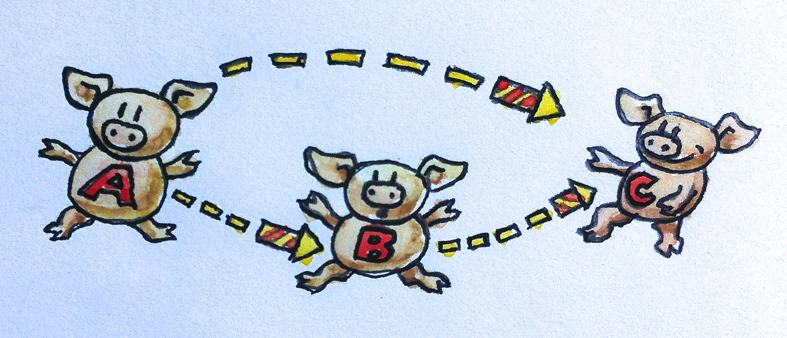

# 범주: 합성의 본질

> 저는 제 이전 게시물인 프로그래머를 위한 범주론의 서문에 대한 긍정적인 반응에 압도되었습니다. 동시에 사람들이 저에게 얼마나 큰 기대를 하고 있는지를 알았기 때문에 저를 두렵게 했습니다. 제가 어떤 글을 써도 독자들이 실망할까 봐 두렵습니다. 어떤 독자는 이 책이 실용적이기를 원하고 어떤 독자는 더 추상적이기를 원합니다. 어떤 사람은 C++를 싫어하고 Haskell로 된 모든 예제를 원하고, 다른 사람은 Haskell을 싫어하고 Java 예제를 요구할 수 있습니다. 그리고 저는 설명을 하는 속도가 누군가에게는 너무 느리고 누군가에게는 너무 빠를 것이라는 것을 알고 있습니다. 이것은 완벽한 책은 아닙니다. 이것으로 타협이 될 것입니다. 제가 바랄 수 있는 것은 제가 깨달은 것 일부를 공유할 수 있다는 것뿐입니다. 기초부터 시작하겠습니다.

범주는 당황스러울 정도로 단순한 개념입니다. 범주는 객체와 객체 사이를 이동하는 화살표로 구성됩니다. 그래서 범주는 그림으로 표현하기 쉽습니다. 객체는 원이나 점으로 그릴 수 있으며, 화살표는 화살표입니다. (다양성을 위해 가끔 물건을 돼지처럼, 화살을 불꽃처럼 그립니다) 그러나 범주의 본질은 합성입니다. 또는 원하는 경우 합성의 본질은 범주입니다. 화살표 합성이므로 객체 A에서 객체 B로의 화살표와 객체 B에서 객체 C로의 또 다른 화살표가 있는 경우 A에서 C로 가는 화살표(합성)가 있어야 합니다.


<div align='center'>
  <figure>
    <div>
      
    </div>
    <figcaption>
      범주에서 A에서 B로 가는 화살표와 B에서 C로 가는 화살표가 있으면<br/>
      A에서 C로 직접 향하는 화살표도 있어야 합니다.<br/>
      이 다이어그램은 항등 사상(identity morphisms)이 없기 때문에 전체 범주가 아닙니다. (나중에 참조)
    </figcaption>
  </figure>
</div>

## 함수로서의 화살표

이것들이 이미 너무 추상적인 넌센스였나요? 절망하지 마세요. 구체적인 이야기를 해보겠습니다. 사상이라고도 하는 화살표를 함수로 생각하세요. 타입 A의 인자를 받아 B를 반환하는 함수 f가 있습니다. B를 인자로 받고 C를 반환하는 또 다른 함수 g가 있습니다. f의 결과를 g에 전달하여 합성할 수 있습니다. A를 받고 C를 반환하는 새로운 함수를 방금 정의했습니다.

수학에서 이러한 합성은 함수 사이의 작은 원(g∘f)으로 표현됩니다. 조합의 오른쪽에서 왼쪽 순서에 유의해야 합니다. 어떤 사람들에게는 이것이 혼란스러울 수 있습니다. 아래와 같이 Unix의 파이프 표기법에 익숙할 것입니다.

```shell
lsof | grep Chrome
```

또는 F#의 갈매기 모양의 >>, 둘 다 왼쪽에서 오른쪽으로 이동합니다. 그러나 수학과 Haskell 함수에서는 오른쪽에서 왼쪽으로 합성합니다. g∘f를 "f 후에 g"로 읽으면 도움이 됩니다.

C 코드를 작성하여 이것을 더욱 명시적으로 만들어 보겠습니다. A 타입의 인자를 받고 B 타입의 값을 반환하는 함수 f가 하나 있습니다.

```
B f(A a);
```

그리고 B타입의 인자를 받고 C 타입의 값을 반환하는 또 다른 함수가 있습니다.

```
C g(B b);
```

이것들의 합성은 아래와 같습니다.

```
C g_after_f(A a)
{
    return g(f(a));
}
```

여기에서 다시 오른쪽에서 왼쪽으로 합성되는 `g(f(a));`를 C 코드에서 볼 수 있습니다.

C++ 표준 라이브러리에는 두 개의 함수를 사용하고 합성을 반환하는 템플릿이 있다고 말하고 싶지만 없다는 것을 말하고 싶습니다. 변화를 위해 하스켈로 같은 내용을 작성해 보겠습니다. 여기에 A를 받아 B를 반환하는 함수 선언이 있습니다.

```
f :: A -> B
```

비슷하게 B를 받아 C를 반환하는 함수 선언이 있습니다.

```
g :: B -> C
```

이것들의 합성은 아래와 같습니다.

```
g . f
```

Haskell이 얼마나 간단한지 알게 되면 C++에서 간단한 함수형 개념을 표현할 수 없다는 것이 조금 당황스러울 수 있습니다. 사실 Haskell은 유니코드 문자를 사용할 수 있게 해주므로 아래와 같이 합성을 작성할 수 있습니다.

```
g ∘ f
```

유니코드 이중 콜론과 화살표를 사용할 수도 있습니다.

```
f ∷ A → B
```

그래서 여기 첫 번째 Haskell 수업이 있습니다. 이중 콜론은 "다음 타입을 가짐"을 의미합니다. 함수 타입은 두 타입 사이에 화살표를 삽입하여 생성됩니다. 두 함수 사이에 마침표(또는 유니코드 원)를 삽입해 두 함수를 합성합니다.

## 합성의 속성

모든 범주가 만족해야 하는 두 가지 매우 중요한 속성이 있습니다.

1. 합성은 결합성이 있습니다. 합성할 수 있는 세 가지 사상인 f, g, h가 있는 경우(즉, 객체가 종단 간 일치합니다) 합성을 하기 위해 괄호가 필요하지 않습니다. 수학적으로 표현한다면 다음과 같이 표현할 수 있습니다.


$h∘(g∘f) = (h∘g)∘f = h∘g∘f$

Haskell의 의사 코드로는 아래와 같이 표현할 수 있습니다.

```
f :: A -> B
g :: B -> C
h :: C -> D
h . (g . f) == (h . g) . f == h . g . f
```

(저는 함수에 대해 동등함이 정의되지 않았기 때문에 "의사"라고 표현했습니다.)

결합성은 함수를 다룰 때 매우 분명하지만 다른 범주에서는 그렇게 분명하지 않을 수 있습니다.

1. 모든 객체 A에는 합성 단위인 화살표가 있습니다. 이 화살표는 객체 자신을 가리킵니다. 합성 단위라는 것은 각각 A에서 시작하거나 A에서 끝나는 화살표로 합성될 때 동일한 화살표를 반환한다는 것을 의미합니다. 객체 A에 대한 단위 화살표를 idA(A에 항등, identity on A)라고 부릅니다. 수학적 표현에서 f가 A에서 B로 이동한다면 아래와 같이 표현할 수 있습니다.

$f∘id_A = f$ 그리고 $id_B∘f = f$

함수를 다룰 때, 항등 화살표는 인자를 그대로 반환하는 항등함수로 구현됩니다. 구현은 모든 타입에 대해 동일합니다. 즉, 이 함수는 다형성을 갖는다는 것을 의미합니다. C++에서는 다음과 같은 템플릿으로 표현할 수 있습니다.

```cpp
template<class T> T id(T x) { return x; }
```

물론 C++에서는 전달하는 내용뿐만 아니라 방법(값, 참조, 상수 참조, 이동 등)도 고려해야 하기 때문에 그렇게 간단하지 않습니다.

Haskell에서는 항등 함수는 Prelude라고 불리는 표준 라이브러리의 일부입니다. 선언과 정의는 아래와 같습니다.

```
id :: a -> a
id x = x
```

보시다시피, Haskell의 다형성 함수는 식은 죽 먹기입니다. 선언에서 타입을 타입 변수로 바꾸기만 하면 됩니다. 여기에는 트릭이 있습니다. 구체적인 타입의 이름은 항상 대문자로 시작하고 타입 변수의 이름은 소문자로 시작합니다. 그래서 여기서 a는 모든 타입을 의미합니다.

Haskell 함수 정의는 함수 이름과 형식 매개변수로 구성되어 있습니다. 여기서는 x 하나만 있습니다. 함수의 본문은 등호를 따릅니다. 이 간결함은 종종 새로운 사람들에게 충격을 주지만 완벽하게 이해된다는 것을 금세 알게 될 것입니다. 함수 정의와 함수 호출은 함수형 프로그래밍의 핵심이므로 최소한으로 줄어듭니다. 인자 목록 주위에 괄호가 없을 뿐 아니라 인자 사이에 쉼표도 없습니다. (나중에 여러 인자를 갖는 함수를 정의할 때 볼 수 있습니다)


함수의 본문은 항상 표현식입니다. 함수에는 문이 존재하지 않습니다. 함수의 결과는 여기서는 x인 표현식 입니다.

이것으로 두 번째 Haskell 수업을 마칩니다.

항등 조건은 의사 Haskell 코드로 아래와 같이 작성될 수 있습니다.


```
f . id == f
id . f == f
```

당신은 스스로 왜 누군가 아무것도 하지 않는 항등함수에 신경을 쓰지 않을까? 하는 질문을 할 수 있습니다. 그렇다면 우리는 왜 숫자 0에 신경을 써야 할까요? 0은 무의미한 상징입니다. 고대 로마인들은 0이 없는 숫자 체계를 가지고 있었고 훌륭한 도로와 수로를 건설할 수 있었고 그중 일부는 오늘날까지 남아 있습니다.

0 또는 항등함수와 같은 중립 값은 기호 변수로 작업할 때 매우 유용합니다. 그래서 로마인들은 대수학을 잘하지 못했지만, 0의 개념에 익숙한 아랍인과 페르시아인은 대수학을 잘했습니다. 따라서 항등 함수는 고차 함수에 대한 인수 또는 반환으로 매우 편리하게 사용됩니다. 고차 함수는 함수의 상징적 조작을 가능하게 하는 것입니다. 고차 함수는 함수의 대수입니다.


요약하자면 범주는 객체와 화살표 (사상)으로 구성됩니다. 화살표는 합성될 수 있으며 합성은 결합성이 있습니다. 모든 객체에는 합성에서 단위 역할을 하는 항등 화살표가 있습니다.

## 합성은 프로그래밍의 본질입니다.

Functional programmers have a peculiar way of approaching problems. They start by asking very Zen-like questions. For instance, when designing an interactive program, they would ask: What is interaction? When implementing Conway’s Game of Life, they would probably ponder about the meaning of life. In this spirit, I’m going to ask: What is programming? At the most basic level, programming is about telling the computer what to do. “Take the contents of memory address x and add it to the contents of the register EAX.” But even when we program in assembly, the instructions we give the computer are an expression of something more meaningful. We are solving a non-trivial problem (if it were trivial, we wouldn’t need the help of the computer). And how do we solve problems? We decompose bigger problems into smaller problems. If the smaller problems are still too big, we decompose them further, and so on. Finally, we write code that solves all the small problems. And then comes the essence of programming: we compose those pieces of code to create solutions to larger problems. Decomposition wouldn’t make sense if we weren’t able to put the pieces back together.

This process of hierarchical decomposition and recomposition is not imposed on us by computers. It reflects the limitations of the human mind. Our brains can only deal with a small number of concepts at a time. One of the most cited papers in psychology, The Magical Number Seven, Plus or Minus Two, postulated that we can only keep 7 ± 2 “chunks” of information in our minds. The details of our understanding of the human short-term memory might be changing, but we know for sure that it’s limited. The bottom line is that we are unable to deal with the soup of objects or the spaghetti of code. We need structure not because well-structured programs are pleasant to look at, but because otherwise our brains can’t process them efficiently. We often describe some piece of code as elegant or beautiful, but what we really mean is that it’s easy to process by our limited human minds. Elegant code creates chunks that are just the right size and come in just the right number for our mental digestive system to assimilate them.

So what are the right chunks for the composition of programs? Their surface area has to increase slower than their volume. (I like this analogy because of the intuition that the surface area of a geometric object grows with the square of its size — slower than the volume, which grows with the cube of its size.) The surface area is the information we need in order to compose chunks. The volume is the information we need in order to implement them. The idea is that, once a chunk is implemented, we can forget about the details of its implementation and concentrate on how it interacts with other chunks. In object-oriented programming, the surface is the class declaration of the object, or its abstract interface. In functional programming, it’s the declaration of a function. (I’m simplifying things a bit, but that’s the gist of it.)

Category theory is extreme in the sense that it actively discourages us from looking inside the objects. An object in category theory is an abstract nebulous entity. All you can ever know about it is how it relates to other object — how it connects with them using arrows. This is how internet search engines rank web sites by analyzing incoming and outgoing links (except when they cheat). In object-oriented programming, an idealized object is only visible through its abstract interface (pure surface, no volume), with methods playing the role of arrows. The moment you have to dig into the implementation of the object in order to understand how to compose it with other objects, you’ve lost the advantages of your programming paradigm.

## Challenges
1. Implement, as best as you can, the identity function in your favorite language (or the second favorite, if your favorite language happens to be Haskell).
2. Implement the composition function in your favorite language. It takes two functions as arguments and returns a function that is their composition.
3. Write a program that tries to test that your composition function respects identity.
4. Is the world-wide web a category in any sense? Are links morphisms?
5. Is Facebook a category, with people as objects and friendships as morphisms?
6. When is a directed graph a category?

[⬅ 뒤로가기](https://github.com/alstn2468/category-theory-for-programmers#%ED%94%84%EB%A1%9C%EA%B7%B8%EB%9E%98%EB%A8%B8%EB%A5%BC-%EC%9C%84%ED%95%9C-%EB%B2%94%EC%A3%BC%EB%A1%A0) / [다음으로 ➡](https://github.com/alstn2468/category-theory-for-programmers/blob/main/part-1/2-types-and-functions.md)